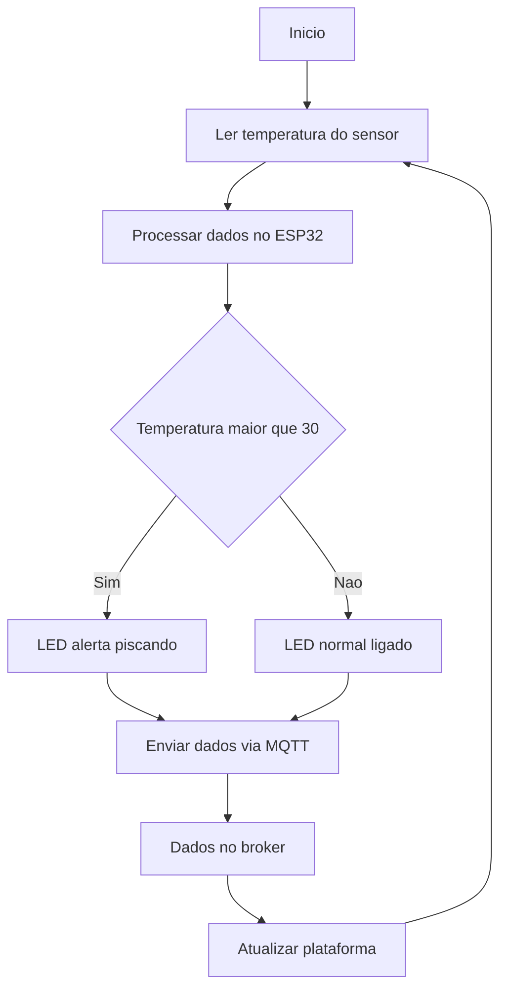

# TermôPets: Sistema Iot para Monitoramento da Temperatura do Asfalto a fim de proteger animais em ambientes urbanos.

**Faculdade de Computação e Informática Universidade Presbiteriana Mackenzie (UPM) – São Paulo, SP – Brazil**

Grupo: 5

Integrantes:
- Aline Soares Cordeiro
- Fernanda Sther Magalhães Lopes
- Mayara Alves da Silva
  
# 1. Descrição 
Esse trabalho tem como finalidade desenvolver um sistema com base na Internet das Coisas (IoT) intitulado “TermôPets”, dedicado ao acompanhamento de temperatura em tempo real da principal superfície urbana, o asfalto. 

## 1.1 Funcionamento 
O sistema utiliza sensores infravermelhos de temperatura, instalados em pontos estratégicos urbanos como postes, aptos a medir a temperatura do terreno sem precisar de ter uma proximidade física. As informações obtidas serão direcionadas para uma plataforma digital que indicará a temperatura no trajeto desejado, mostrará um trajeto seguro  e enviará alertas para os tutores, se necessário. Além disso, pretendemos utilizar ícones visuais urbanos, como placas de LEDs nos postes, que indicarão a temperatura atual. O propósito do sistema é auxiliar na construção de uma cidade mais acessível, saudável e sustentável, impulsionando uma atividade mais segura para pessoas e animais.

# 2. Estrutura do repositório
- code/ --> código do ESP32
- docs/ --> documentação do projeto
- images/ --> diagrama e imagens

# 3. Sobre o código
O código foi desenvolvido para o ESP32 e realiza a seguintes tarefas:

- Conexão com Wi-fi
- Se comunicar com o broker MQTT
- Enviar as informações de temperatura
- Controlas o LED como atuador

# 4. Hardware escolhido
- ESP32
- Sensor de tempertura chamado MLX90614
- Módulo de LEDs
- Resistor
- HiveMQ
- Wokwi (plataforma para montagem)

# 5. Comunicação MQTT
No TermôPets, o ESP32 atuará como cliente MQTT, publicando os valores de temperatura em tópicos específicos. Um broker MQTT que e distribuirá as mensagens para assinantes, como a plataforma de visualização e aplicativos móveis. A utilização de mensagens retidas permitirá que novos clientes recebam a última temperatura publicada imediatamente após a conexão (SANTOS et al., s.d.). Comunicação e Broker MQTTA transmissão de dados entre o ESP32 e a plataforma digital ocorre via protocolo MQTT (Message Queuing Telemetry Transport), escolhido por sua leveza e eficiência em aplicações IoT.Conforme a necessidade de especificação do sistema, o broker utilizado é o HiveMQ (HIVE, 2026), uma plataforma de broker MQTT bastante usada em ambientes acadêmicos, devido a sua confiabilidade, simplicidade e suporte à integração em tempo real. O ESP32 contribui como editor, enviando as informações coletadas para o broker, enquanto o monitoramento tem o papel de apoiador para atualizar os dados sem atraso.

# 6. Como executar ?
1. Abrir a plataforma Wokwi.
2. Montar o circuito utilizando ESP32, DS18B20( escolhido somente para a simulação) e LED (NeoPixel).
3. Inserir o código disponibilizado neste repositório.
4. Executar a simulação.
5. Utilizar MQTT Explorer para visualizar os dados MQ

# 7. Software desenvolvido
- O software foi desenvolvido em linguagem C++ utilizando, o sistema realiza:
- conexão Wi-Fi;
- conexão MQTT;
- leitura do sensor;
- controle do LED;
- envio dos dados de temperatura em tempo real

O protocolo MQTT foi utilizado para comunicação IoT devido à sua leveza e eficiência em aplicações embarcadas.

# 8. Imagens
colocar aqui a imagem do protótipo do sistema.

# 9. Vídeo

