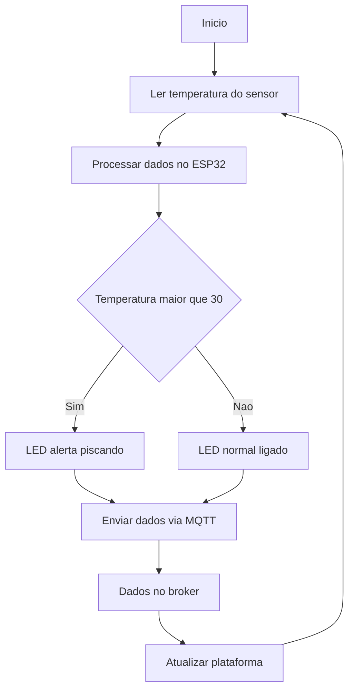

# FUNCIONAMENTO DO SISTEMA
O sistema utiliza sensores infravermelhos de temperatura, instalados em pontos estratégicos urbanos como postes, aptos a medir a temperatura do terreno sem precisar de ter uma proximidade física. As informações obtidas serão direcionadas via protocolo MQTT para uma plataforma digital que indicará a temperatura no trajeto desejado, mostrará um trajeto seguro  e enviará alertas para os tutores, se necessário. Além disso, pretendemos utilizar ícones visuais urbanos, como placas de LEDs (atuador), nos postes, que indicarão a temperatura atual. O propósito do sistema é  auxiliar na construção de uma cidade mais acessível, saudável e sustentável, impulsionando uma atividade mais segura para pessoas e animais.

## 1. HARDWARE UTILIZADO
- ESP32: processa os dados coletados pelo sensor e transmite via MQTT.
- Sensor de temperatura: realiza a leitura digital da temperatura da superfície.
- LEDs: altera sua cor conforme a mudança de clima.
- Resistor: fonte de alimentação.
- HiveMQ: plataforma que permite o monitoramento em tempo real das mensagens publicadas.

## 2. INTEGRAÇÃO DO SISTEMA

## 3. COMO REPRODUZIR O PROJETO
1. Montar circuito
2. Configurar o código no ESP32
3. Conectar à rede Wi-Fi
4. Executar o código
5. Monitorar os dados via MQTT

## 4. PROTOCOLOS UTILIZADOS
- Comunicação Wi-Fi (TCP/IP)
- Protocolo MQTT

## 5. CONSIDERAÇÕES
O projeto se caracteriza como uma aplicação de Internet das Coisas (IoT), integrando sensores, atuadores e comunicação em rede para monitoramento remoto e tomada de decisão em tempo real.
