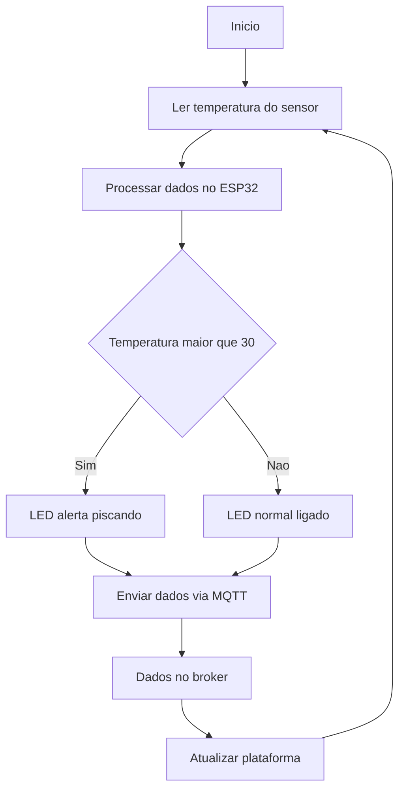

# FUNCIONAMENTO DO SISTEMA
O sistema utiliza sensores infravermelhos de temperatura, instalados em pontos estratégicos urbanos como postes, aptos a medir a temperatura do terreno sem precisar de ter uma proximidade física. As informações obtidas serão direcionadas via protocolo MQTT para uma plataforma digital que indicará a temperatura no trajeto desejado, mostrará um trajeto seguro  e enviará alertas para os tutores, se necessário. Além disso, pretendemos utilizar ícones visuais urbanos, como placas de LEDs (atuador), nos postes, que indicarão a temperatura atual. O propósito do sistema é  auxiliar na construção de uma cidade mais acessível, saudável e sustentável, impulsionando uma atividade mais segura para pessoas e animais.

## Materiais
### 1. Plataforma baseada em ESP32
O coração do sistema é a placa de desenvolvimento ESP32, baseada no SoC ESP32 da Espressif Systems. O ESP32 é um chip combo de 2,4 GHz com Wi-Fi 802.11 b/g/n e Bluetooth (BR/EDR e BLE) integrados, desenvolvido com tecnologia de 40 nm para oferecer baixo consumo de energia e alto desempenho. O chip possui dois núcleos de 32 bits Xtensa LX6 com frequência de até 240 MHz, 448 KB de ROM, 520 KB de SRAM interna, podendo utilizar memória externa (PSRAM em alguns modelos), e diversos periféricos, incluindo ADC de 12 bits, DAC de 8 bits, até cerca de 34 pinos GPIO utilizáveis, interfaces SPI/I²S/I²C/UART, temporizadores e sensores táteis.
A placa ESP32 do kit SunFounder integra esse SoC com antena e reguladores de tensão, proporcionando um módulo compacto e versátil. O guia do kit destaca as principais características: processador de dois núcleos, conectividade Wi-Fi e Bluetooth integrada, ampla memória, até cerca de 34 pinos GPIO utilizáveis, múltiplos modos de economia de energia e recursos de segurança (criptografia e boot seguro). Essas características tornam o ESP32 ideal para aplicações IoT que exigem desempenho, conectividade sem fio e baixo consumo.

### 2. Sensor de temperatura
Para medir a temperatura do asfalto sem contato, será utilizado o sensor infravermelho MLX90614. Este sensor possui um sistema óptico integrado, amplificador de baixo ruído, conversor analógico-digital (ADC) de 17 bits e algoritmo de auto-calibração digital, o que garante medições rápidas, precisas e estáveis (DFROBOT, s.d.; ESP EASY DOCUMENTATION, s.d.).
O MLX90614 opera com tensão de 3,3 V a 5 V, consome aproximadamente 1,2 mA e comunica-se via interface I²C. Ele pode medir temperaturas de –70,01 °C até +382,19 °C com resolução de 0,01 °C e alta precisão (±0,5 °C em condições ideais), permitindo monitorar a temperatura da superfície do pavimento em diversas condições ambientais.
O sensor será fixado em um suporte no poste, direcionado para o asfalto. Seus pinos SDA e SCL serão conectados às entradas I²C do ESP32, enquanto os pinos VCC e GND serão alimentados por 3,3 V e terra da placa.

## 3. Módulos de LEDs em postes inteligentes
Como comunicador visual, será utilizado um conjunto de LEDs instalados em postes bem localizados na cidade, assim formando uma placa indicadora da temperatura do asfalto para os tutores. A placa terá um design intuitivo, onde as cores do plano de fundo da imagem indicará junto com o indicador de grau numérico, por exemplo: entre 0⁰C e 25⁰C = cor verde, entre 26⁰C e 30⁰C = cor amarela e acima de 30⁰C = cor vermelha. Esse método permite que os tutores tenham um retorno imediato da condição térmica sem precisar abrir o seu dispositivo móvel.
A placa será controlada pelo microcontrolador ESP32, por meio de transistores adequados projetados conforme a programação feita. Esse sistema contém um programa de proteção e alerta, onde em caso de altas temperaturas, o painel aciona uma sequência de iluminação piscante que funciona como sinal de alerta para todos os pedestres.

## 4. Comunicação com a IoT via MQTT
A transmissão dos dados do sensor para a plataforma digital será realizada pelo protocolo MQTT. O MQTT é um protocolo de mensagens leve, baseado em TCP/IP, desenvolvido para aplicações IoT. Ele utiliza uma arquitetura de publicação/assinatura (publish/subscribe) com controle de qualidade de serviço (QoS), fila de mensagens e mensagens retidas, possibilitando comunicação bidirecional entre dispositivos e servidores. Após o estabelecimento de uma conexão MQTT, qualquer número de mensagens pode ser enviado nos dois sentidos sem a sobrecarga de protocolos como HTTP. Essas características reduzem o consumo de banda e permitem que dispositivos com recursos limitados, como microcontroladores, transmitam dados de forma eficiente (HIVEMQ, 2026).
No TermôPets, o ESP32 atuará como cliente MQTT, publicando os valores de temperatura em tópicos específicos. Um broker MQTT que e distribuirá as mensagens para assinantes, como a plataforma de visualização e aplicativos móveis. A utilização de mensagens retidas permitirá que novos clientes recebam a última temperatura publicada imediatamente após a conexão (SANTOS et al., s.d.).
Comunicação e Broker MQTTA transmissão de dados entre o ESP32 e a plataforma digital ocorre via protocolo MQTT (Message Queuing Telemetry Transport), escolhido por sua leveza e eficiência em aplicações IoT.Conforme a necessidade de especificação do sistema, o broker utilizado é o HiveMQ (HIVE, 2026), uma plataforma de broker MQTT bastante usada em ambientes acadêmicos, devido a sua confiabilidade, simplicidade e suporte à integração em tempo real. O ESP32  contribui como editor, enviando as informações coletadas para o broker, enquanto o monitoramento tem o papel de apoiador para atualizar os dados sem atraso.

| Componente | Função |
|---|---|
| ESP32 | Microcontrolador principal |
| DS18B20 | Sensor de temperatura |
| NeoPixel WS2812B | LED RGB para sinalização |
| Resistor 4.7kΩ | Pull-up do sensor |
| HiveMQ | Broker MQTT |
| MQTT Explorer | Monitoramento MQTT |

## CONSIDERAÇÕES
O projeto se caracteriza como uma aplicação de Internet das Coisas (IoT), integrando sensores, atuadores e comunicação em rede para monitoramento remoto e tomada de decisão em tempo real.
